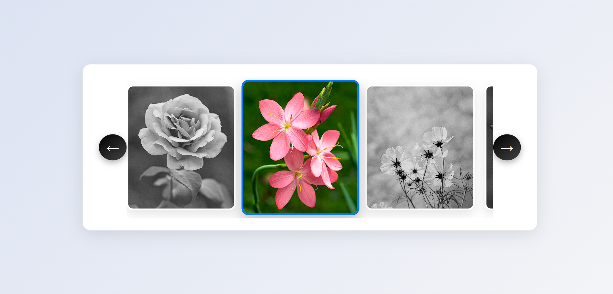

# 📸 Responsive Image Gallery with Scroll Navigation

A clean, fully responsive horizontal image gallery with stylish arrows, smooth scrolling, grayscale hover effects, and mobile-friendly swipe support. Built using **HTML**, **CSS**, and **JavaScript**.

---

## 🌟 Features

- 🔄 **Horizontal scrolling** with left/right arrow buttons  
- 🖼️ **Hover effects** with grayscale to color transition  
- 🧭 **Keyboard navigation** (← and → keys)  
- 📱 **Mobile swipe support**  
- 💡 **Responsive design** for all screen sizes  
- ✨ **Smooth transitions** and subtle animations  

---
## 📸 Project Screenshot

Below is a screenshot of the image gallery in action:

## 📁 Project Structure

image-gallery/
├── index.html # Main HTML structure
├── style.css # Gallery styling
├── script.js # Scroll, navigation, and interaction logic
├── img/
│ ├── img1.jpg
│ ├── img2.jpg
│ ├── img3.jpeg
│ ├── img4.jpg
│ └── img5.jpg
└── README.md # This file

---

## 🚀 How to Use

1. **Clone** or **Download** this repository.
2. Place your images inside the `img/` folder.
3. Open `index.html` in any web browser.
4. Use the arrow buttons, swipe on mobile, or press arrow keys to scroll through the gallery.

---

## 🛠 Technologies Used

- **HTML5**
- **CSS3** (Flexbox, Media Queries, Transitions)
- **JavaScript** (Vanilla, DOM manipulation, Event handling)

---

## 📱 Responsive Behavior

| Device Width | Adjustments                                |
|--------------|---------------------------------------------|
| > 768px      | Full-size layout, large images and arrows   |
| ≤ 768px      | Smaller images and arrow buttons            |
| Mobile       | Touch/swipe support, optimized layout       |

---

## 🎯 Customization Tips

- 💬 **Add more images** by placing `` tags inside the `.gallery` div.
- 🎨 **Change colors** and styles in `style.css` to suit your theme.
- 🔁 **Enable autoplay** by uncommenting the `setInterval()` line in `script.js`.

---

## 👩‍💻 Author

Created by **[ABHIPSA THAKUR]**  
Feel free to use, modify, or share this project!

---

## 📜 License

This project is open-source and available under the **MIT License**.

